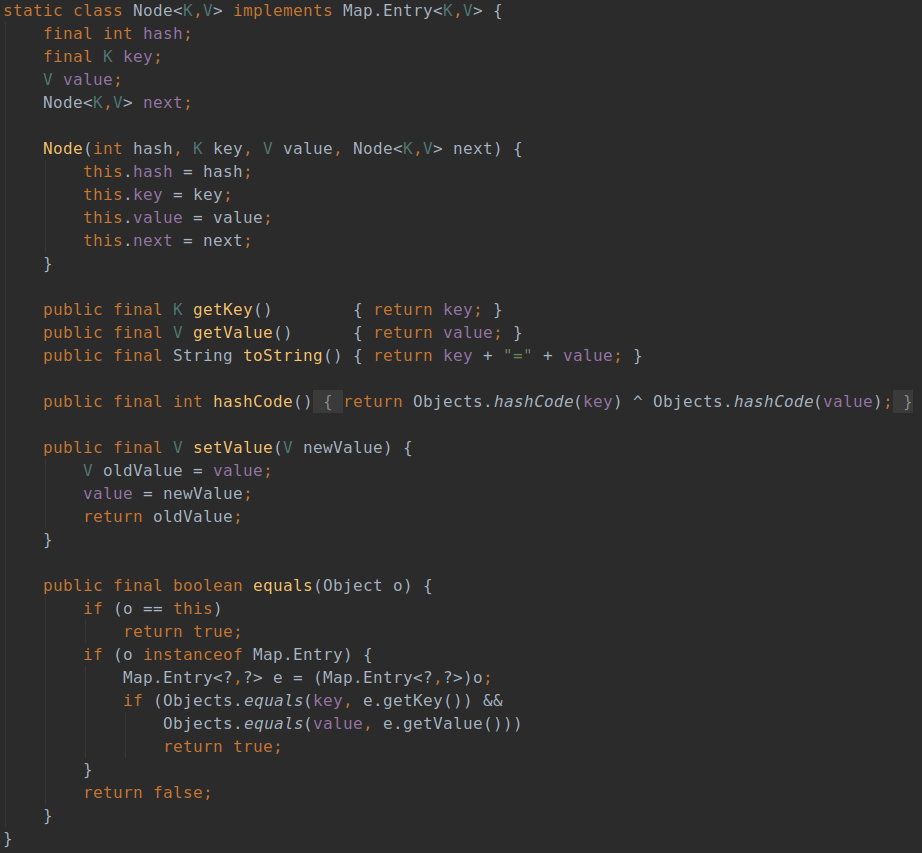
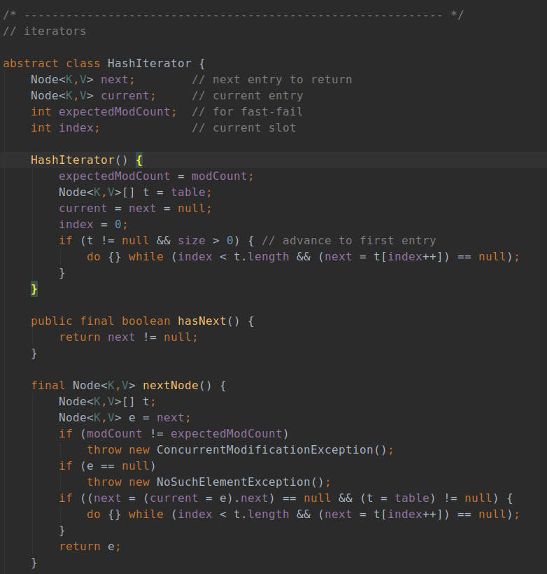
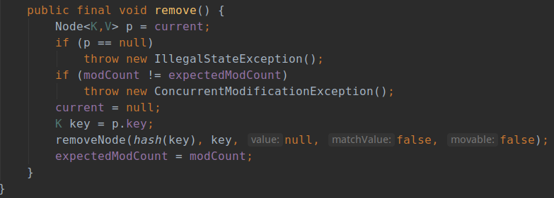
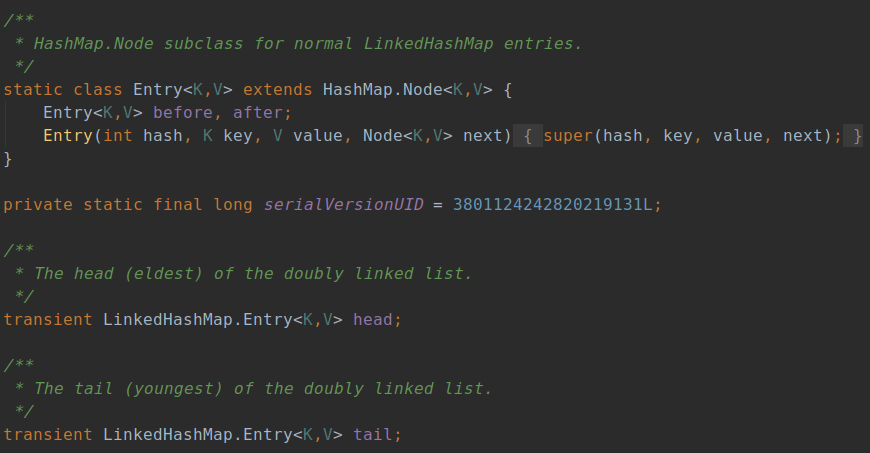
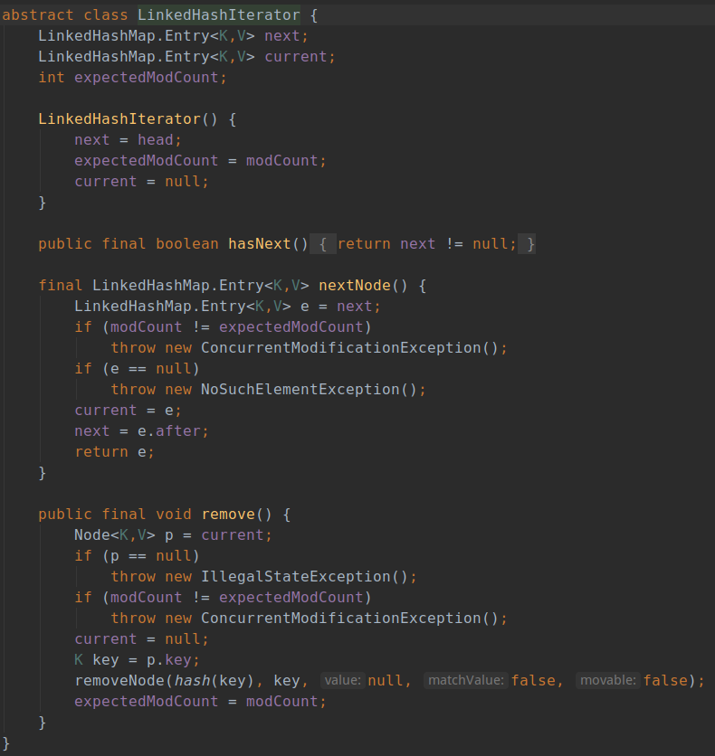

##### 参考博文

[HashMap和有序LinkedHashMap实现对比](https://blog.csdn.net/qq924862077/article/details/74408005#commentBox)


##### 使用差别

```java
        System.out.println("HashMap:");
        HashMap<String, Integer> hashMap = new HashMap<>();
        hashMap.put("e", 1);
        hashMap.put("b", 1);
        hashMap.put("f", 2);
        hashMap.put("g", 1);
        hashMap.put("a", 1);
        hashMap.put("d", 3);
        hashMap.put("c", 1);

        /** 插入与输出顺序不一致
         * a 1
         * b 1
         * c 1
         * d 3
         * e 1
         * f 2
         * g 1
         */
        for (Map.Entry<String, Integer> me: hashMap.entrySet()) {
            System.out.println(me.getKey() + " " + me.getValue());
        }
```

```java
        System.out.println("LinkedHashMap:");

        LinkedHashMap<String, Integer> linkedHashMap = new LinkedHashMap<>();
        linkedHashMap.put("e", 1);
        linkedHashMap.put("b", 1);
        linkedHashMap.put("f", 2);
        linkedHashMap.put("g", 1);
        linkedHashMap.put("a", 1);
        linkedHashMap.put("d", 3);
        linkedHashMap.put("c", 1);

        /** 插入与输出顺序一致
         * e 1
         * b 1
         * f 2
         * g 1
         * a 1
         * d 3
         * c 1
         */
        for (Map.Entry<String, Integer> me: linkedHashMap.entrySet()) {
            System.out.println(me.getKey() + " " + me.getValue());
        }
```

##### 源码差别

> HashMap    原理：哈希表

<!--  -->
> 

<!--  -->
> 

<!--  -->
> 

> LinkedHashMap    原理：哈希表 + 双向链表


> 


> 
