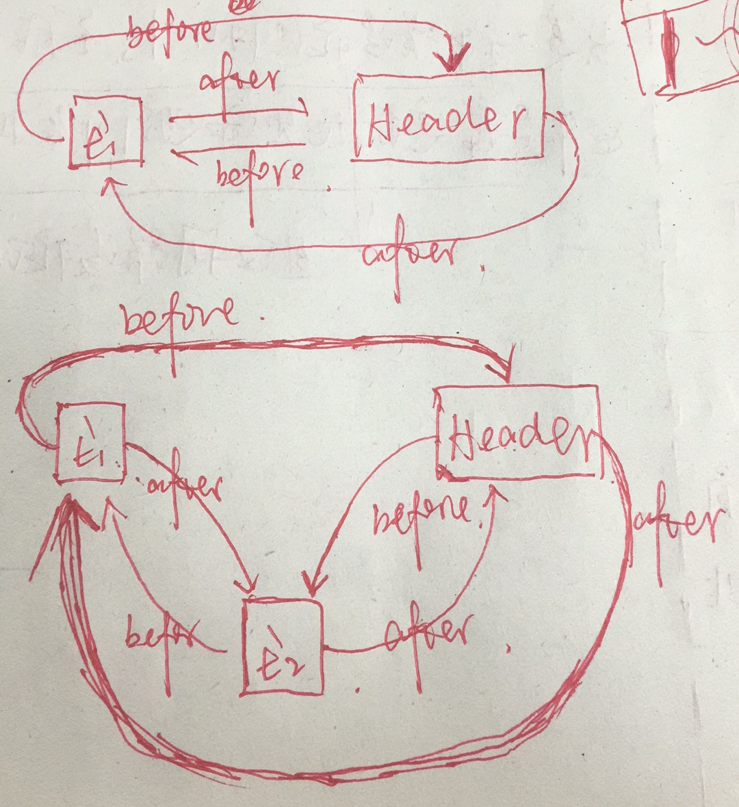

##### 参考博文


##### 构造方法

```java
public class LinkedHashMap<K,V>
    extends HashMap<K,V>
    implements Map<K,V>
```

```java
    public LinkedHashMap(int initialCapacity,
                         float loadFactor,
                         boolean accessOrder) {
        // 父类构造器为HashMap(initialCapacity, loadFactor)
        super(initialCapacity, loadFactor);
        // accessOrder为false表明按照插入顺序
        // accessOrder为true 表明按照访问顺序
        this.accessOrder = accessOrder;
    }
```

```java
// 父类构造器HashMap
public HashMap(int initialCapacity, float loadFactor) {
        if (initialCapacity < 0)
            throw new IllegalArgumentException("Illegal initial capacity: " +
                                               initialCapacity);
        if (initialCapacity > MAXIMUM_CAPACITY)
            initialCapacity = MAXIMUM_CAPACITY;
        if (loadFactor <= 0 || Float.isNaN(loadFactor))
            throw new IllegalArgumentException("Illegal load factor: " +
                                               loadFactor);

        this.loadFactor = loadFactor;
        threshold = initialCapacity;
        // 变化
        init();
    }
```

```java
    @Override // init 被重写
    void init() {
        header = new Entry<>(-1, null, null, null);
        // 开始构建双向链接列表
        header.before = header.after = header;
    }
```

##### Entry<K, V>变化

```java
    private static class Entry<K,V> extends HashMap.Entry<K,V> {
        // These fields comprise the doubly linked list used for iteration.

        // 新增了before和after指针
        Entry<K,V> before, after;

        Entry(int hash, K key, V value, HashMap.Entry<K,V> next) {
            // 父类的构造方法
            super(hash, key, value, next);
        }

        // 移除双向链接列表中某一个节点
        private void remove() {
            before.after = after;
            after.before = before;
        }

        // 将某一个节点添加到双向链接列表中
        private void addBefore(Entry<K,V> existingEntry) {
            after  = existingEntry;
            before = existingEntry.before;
            before.after = this;
            after.before = this;
        }

        // 根据访问顺序调整双向链接列表
        void recordAccess(HashMap<K,V> m) {
            LinkedHashMap<K,V> lm = (LinkedHashMap<K,V>)m;
            if (lm.accessOrder) {
                lm.modCount++;
                remove();
                addBefore(lm.header);
            }
        }

        // 执行移除操作
        void recordRemoval(HashMap<K,V> m) {
            remove();
        }
    }
```

##### Put操作

```java
// 父类HashMap的put方法
public V put(K key, V value) {
        if (table == EMPTY_TABLE) {
            inflateTable(threshold);
        }

        // LinkedHashMap的键和值允许为空
        if (key == null)
            return putForNullKey(value);

        // 索引操作   
        int hash = hash(key);
        int i = indexFor(hash, table.length);

        // 遍历操作
        for (Entry<K,V> e = table[i]; e != null; e = e.next) {
            Object k;
            if (e.hash == hash && ((k = e.key) == key || key.equals(k))) {
                V oldValue = e.value;
                e.value = value;
                // LinkedHashMap中重写了这个方法
                e.recordAccess(this);
                return oldValue;
            }
        }

        modCount++;
        // LinkedHashMap中重写了这个方法
        addEntry(hash, key, value, i);
        return null;
    }
```

```java
void addEntry(int hash, K key, V value, int bucketIndex) {
        // 扩容操作可能发生
        super.addEntry(hash, key, value, bucketIndex);

        // Remove eldest entry if instructed
        Entry<K,V> eldest = header.after;

        // removeEldestEntry方法总是返回false
        // 实现LRU时需要重写这个方法
        if (removeEldestEntry(eldest)) {
            removeEntryForKey(eldest.key);
        }
    }
```

```java
void createEntry(int hash, K key, V value, int bucketIndex) {
        HashMap.Entry<K,V> old = table[bucketIndex];
        Entry<K,V> e = new Entry<>(hash, key, value, old);
        table[bucketIndex] = e;

        // 增加了双向链接列表操作
        e.addBefore(header);
        size++;
    }
```

##### Get操作

```java
public V get(Object key) {
        Entry<K,V> e = (Entry<K,V>)getEntry(key);
        if (e == null)
            return null;
        e.recordAccess(this);
        return e.value;
    }
```

##### LinkedHashMap和HashMap扩容对比

>         LinkedHashMap扩容时，数据的再散列和HashMap是不一样的。


>         HashMap是先遍历旧table，再遍历旧table中每个元素的单向链表，取得Entry以后，重新计算hash值，然后存放到新table的对应位置。


>         LinkedHashMap是遍历的双向链表，取得每一个Entry，然后重新计算hash值，然后存放到新table的对应位置。


>         从遍历的效率来说，遍历双向链表的效率要高于遍历table，因为遍历双向链表是N次（N为元素个数）；而遍历table是N + able的空余个数（即没有Entry链的部分）。

```java
// LinkedHashMap
    @Override
    void transfer(HashMap.Entry[] newTable, boolean rehash) {
        int newCapacity = newTable.length;
        for (Entry<K,V> e = header.after; e != header; e = e.after) {
            if (rehash)
                e.hash = (e.key == null) ? 0 : hash(e.key);

            int index = indexFor(e.hash, newCapacity);
            e.next = newTable[index];
            newTable[index] = e;
        }
    }
```

```java
// HashMap
void transfer(Entry[] newTable, boolean rehash) {
        int newCapacity = newTable.length;
        for (Entry<K,V> e : table) {
            while(null != e) {
                Entry<K,V> next = e.next;
                if (rehash) {
                    e.hash = null == e.key ? 0 : hash(e.key);
                }

                int i = indexFor(e.hash, newCapacity);
                e.next = newTable[i];
                newTable[i] = e;
                e = next;
            }
        }
    }
```

##### remove和addBefore附图



##### LRUDemo

```java
// true表示访问顺序，false表示插入顺序
map = new LinkedHashMap<K, V>(hashTableCapacity,
    hashTableLoadFactor, true) {
            @Override
            protected boolean removeEldestEntry(Map.Entry eldest) {
                return size() > LRUDemo2.this.cacheSize;
            }
        };
```
