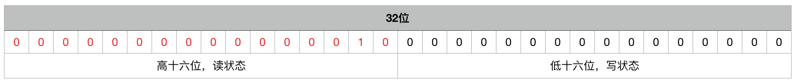

##### 参考博文

[独享锁 VS 共享锁](https://tech.meituan.com/2018/11/15/java-lock.html)


##### ReentrantReadWriteLock总体设计

```java
public class ReentrantReadWriteLock
        implements ReadWriteLock, java.io.Serializable {

    /** Inner class providing readlock */
    private final ReentrantReadWriteLock.ReadLock readerLock;
    /** Inner class providing writelock */
    private final ReentrantReadWriteLock.WriteLock writerLock;
    /** Performs all synchronization mechanics */
    final Sync sync;

    public ReentrantReadWriteLock() {
        this(false);
    }

    public ReentrantReadWriteLock(boolean fair) {
        sync = fair ? new FairSync() : new NonfairSync();
        readerLock = new ReadLock(this);
        writerLock = new WriteLock(this);
    }

    public ReentrantReadWriteLock.WriteLock writeLock() { return writerLock; }
    public ReentrantReadWriteLock.ReadLock  readLock()  { return readerLock; }
    ...
}
```

##### 内部类ReadLock设计

> 读锁：共享锁

```java
public static class ReadLock implements Lock, java.io.Serializable {
    protected ReadLock(ReentrantReadWriteLock lock) {
         sync = lock.sync;
    }

    public void lock() {
         sync.acquireShared(1);
    }
    // 尝试增加读锁
    public boolean tryLock() {
         return sync.tryReadLock();
    }

    public void unlock() {
         sync.releaseShared(1);
    }

    ...
}
```

##### 内部类ReadLock外部实现

> 尝试获取读锁

```java
    protected final int tryAcquireShared(int unused) {
            /*
             * Walkthrough:
             * 1. If write lock held by another thread, fail.
             * 2. Otherwise, this thread is eligible for
             *    lock wrt state, so ask if it should block
             *    because of queue policy. If not, try
             *    to grant by CASing state and updating count.
             *    Note that step does not check for reentrant
             *    acquires, which is postponed to full version
             *    to avoid having to check hold count in
             *    the more typical non-reentrant case.
             * 3. If step 2 fails either because thread
             *    apparently not eligible or CAS fails or count
             *    saturated, chain to version with full retry loop.
             */
            Thread current = Thread.currentThread();
            int c = getState();
            // 写锁的重入数目不为0，当前线程又不是写锁，返回fail
            if (exclusiveCount(c) != 0 &&
                getExclusiveOwnerThread() != current)
                return -1;
            // 写锁的数目为0，尝试加锁
            int r = sharedCount(c);
            if (!readerShouldBlock() &&
                r < MAX_COUNT &&
                // CAS加锁
                compareAndSetState(c, c + SHARED_UNIT)) {
                // 读锁的数目为0，第一次加锁，该锁的可重入数目为1
                if (r == 0) {
                    firstReader = current;
                    firstReaderHoldCount = 1;
                // 读锁的数目不为0，当前线程与第一个读线程是同一线程
                // 增加首个读线程的可重入次数
                } else if (firstReader == current) {
                    firstReaderHoldCount++;
                // 读锁数目为0，当前线程与第一个读线程不是是同一线程
                } else {
                    HoldCounter rh = cachedHoldCounter;
                    if (rh == null || rh.tid != getThreadId(current))
                        cachedHoldCounter = rh = readHolds.get();
                    else if (rh.count == 0)
                        readHolds.set(rh);
                    // 增加其他读线程rh的可重入次数
                    rh.count++;
                }
                return 1;
            }
            // 循环尝试加锁操作，直至加锁成功
            return fullTryAcquireShared(current);
        }
```

> 尝试释放读锁

```java
    protected final boolean tryReleaseShared(int unused) {

            Thread current = Thread.currentThread();

            // 释放首线程的锁
            if (firstReader == current) {
                // assert firstReaderHoldCount > 0;
                if (firstReaderHoldCount == 1)
                    firstReader = null;
                else
                    firstReaderHoldCount--;
            // 释放其他线程的锁
            } else {
                HoldCounter rh = cachedHoldCounter;
                if (rh == null || rh.tid != getThreadId(current))
                    rh = readHolds.get();
                int count = rh.count;
                if (count <= 1) {
                    readHolds.remove();
                    if (count <= 0)
                        throw unmatchedUnlockException();
                }
                --rh.count;
            }
            // CAS循环更新state值
            for (;;) {
                int c = getState();
                int nextc = c - SHARED_UNIT;
                if (compareAndSetState(c, nextc))
                    // Releasing the read lock has no effect on readers,
                    // but it may allow waiting writers to proceed if
                    // both read and write locks are now free.
                    return nextc == 0;
            }
        }
```

```java
 // 读锁的使用技巧---ThreadLocal
 static final class HoldCounter {
     int count = 0;
     // Use id, not reference, to avoid garbage retention
     final long tid = getThreadId(Thread.currentThread());
 }

 static final class ThreadLocalHoldCounter
         extends ThreadLocal<HoldCounter> {
     public HoldCounter initialValue() {
         return new HoldCounter();
     }
 }

 private transient ThreadLocalHoldCounter readHolds;

 private transient HoldCounter cachedHoldCounter;
```

##### 内部类WriteLock设计

> 写锁：排它锁

```java
public static class WriteLock implements Lock, java.io.Serializable {
        private final Sync sync;

        protected WriteLock(ReentrantReadWriteLock lock) {
            sync = lock.sync;
        }

        public void lock() {
            sync.acquire(1);
        }

        public boolean tryLock( ) {
            return sync.tryWriteLock();
        }

        public void unlock() {
            sync.release(1);
        }

        ...
}
```

#### 内部类WriteLock外部实现

> 尝试获取写锁

```java
    protected final boolean tryAcquire(int acquires) {
            /*
             * Walkthrough:
             * 1. If read count nonzero or write count nonzero
             *    and owner is a different thread, fail.
             * 2. If count would saturate, fail. (This can only
             *    happen if count is already nonzero.)
             * 3. Otherwise, this thread is eligible for lock if
             *    it is either a reentrant acquire or
             *    queue policy allows it. If so, update state
             *    and set owner.
             */
            Thread current = Thread.currentThread();
            int c = getState();
            int w = exclusiveCount(c);
            if (c != 0) {
                // (Note: if c != 0 and w == 0
                // then shared count != 0)
                // 如果读锁不为0写锁为0
                // 或者
                // 如果读锁为0写锁不为0且当前线程不是写线程
                if (w == 0 || current != getExclusiveOwnerThread())
                    return false;
                // 超出最大可获取写锁的可重入数量
                if (w + exclusiveCount(acquires) > MAX_COUNT)
                    throw new Error("Maximum lock count exceeded");
                // Reentrant acquire
                // 更新锁状态
                setState(c + acquires);
                return true;
            }
            if (writerShouldBlock() ||
                !compareAndSetState(c, c + acquires))
                return false;
            // 设置写线程，排它锁
            setExclusiveOwnerThread(current);
            return true;
        }
```

> 尝试释放写锁

```java
    protected final boolean tryRelease(int releases) {
            if (!isHeldExclusively())
                throw new IllegalMonitorStateException();
            int nextc = getState() - releases;
            boolean free = exclusiveCount(nextc) == 0;
            // 如果写锁可重入数目为0，释放锁
            if (free)
                setExclusiveOwnerThread(null);
            setState(nextc);
            return free;
        }
```

##### State状态说明

<!--  -->
> 

```java
 static final int SHARED_SHIFT = 16;
 static final int SHARED_UNIT = (1 << SHARED_SHIFT);
 static final int MAX_COUNT = (1 << SHARED_SHIFT) - 1;
 static final int EXCLUSIVE_MASK = (1 << SHARED_SHIFT) - 1;
 /** Returns the number of shared holds represented in count */
 // 取高16位（读状态）
 static int sharedCount(int c)
 { return c >>> SHARED_SHIFT; }
 /** Returns the number of exclusive holds represented in count */
 // 取低16位（写状态）
 static int exclusiveCount(int c)
 { return c & EXCLUSIVE_MASK; }
```
