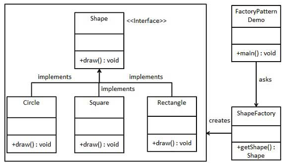

##### 参考博文

[JAVA设计模式之工厂模式（简单工厂模式+工厂方法模式）](https://blog.csdn.net/jason0539/article/details/23020989)

[JAVA设计模式之工厂模式—Factory Pattern](https://www.cnblogs.com/carryjack/p/7709861.html)

[工厂模式](https://www.runoob.com/design-pattern/factory-pattern.html)

##### 附图说明

- 简单工厂模式

<!--  -->
> 

- 工厂方法模式

- 抽象工厂模式

##### 代码说明

- 简单工厂模式

- 工厂方法模式

- 抽象工厂模式

##### 设计思想

>        工厂模式用于对象的创建，使得客户从具体的产品对象中解耦。

##### Spring应用场景

>         Spring使用工厂模式可以通过 `BeanFactory` 或 `ApplicationContext` 创建 bean 对象。
