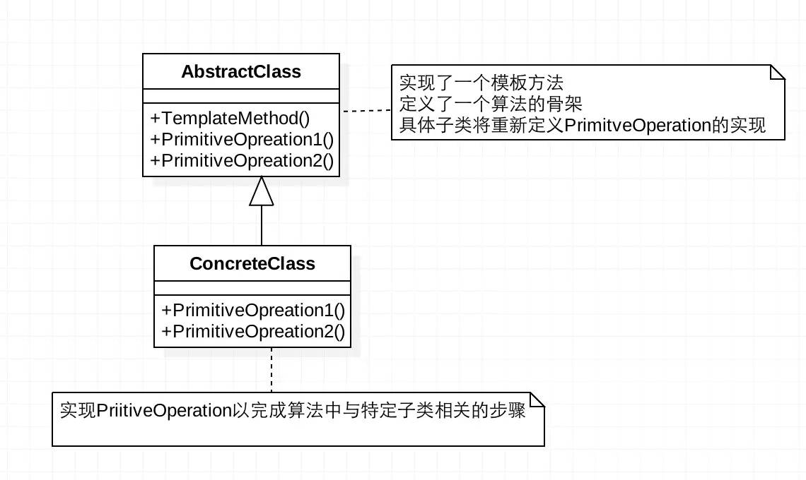

##### 参考博文

[Java 设计模式 ------ 模板设计模式](https://www.cnblogs.com/SamWeb/p/8007533.html)

[设计模式之 - 模板模式（Template Pattern）](https://www.cnblogs.com/qq-361807535/p/6854191.html)

##### 附图说明



##### 代码说明

```java
public abstract class Template {
    //这是我们的模板方法
    public final void TemplateMethod(){
        PrimitiveOperation1();  
        PrimitiveOperation2();
        PrimitiveOperation3();
    }

    protected void  PrimitiveOperation1(){
        //当前类实现
    }

    //被子类实现的方法
    protected abstract void PrimitiveOperation2();
    protected abstract void PrimitiveOperation3();

}
public class TemplateImpl extends Template {

    @Override
    public void PrimitiveOperation2() {
        //当前类实现
    }

    @Override
    public void PrimitiveOperation3() {
        //当前类实现
    }
}
```

##### 设计思想

>         泡茶有以下四个步骤： 1，烧开水； 2， 把茶放到水杯中；3，倒入开水； 4，加糖。

>         泡咖啡有以下四个步骤： 1， 烧开水；2， 把咖啡放到水杯中； 3，倒入开水；4，加入糖和牛奶。

>         综上，可以抽象出一个模板方法：1，开水；2，放入水杯；3，倒入开水，4，加调味剂。

##### Spring应用场景

场景一：

- 根据文件系统目录加载配置文件FileSystemXMLApplicationContext

- 根据类路径加载配置文件ClassPathXMLApplicationContext

- 根据项目上下文加载配置文件XMLWebApplicationContext

场景二：

- jdbcTemplate、hibernateTemplate、...
