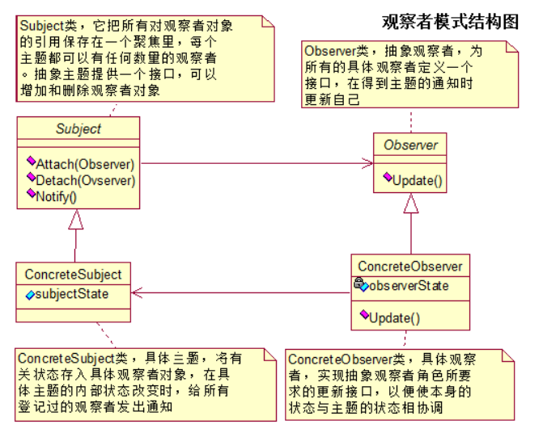
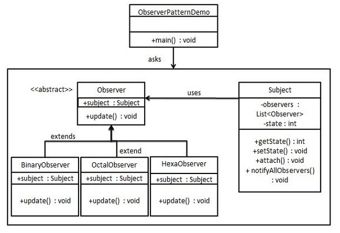

##### 参考博文

[观察者模式](https://www.runoob.com/design-pattern/observer-pattern.html)

[JAVA设计模式之观察者模式](https://www.cnblogs.com/luohanguo/p/7825656.html)

[面试官:谈谈Spring中都用到了哪些设计模式?](https://juejin.im/post/5ce69379e51d455d877e0ca0?utm_source=gold_browser_extension#heading-7)


##### 附图说明

- 观察者作为被观察者的成员变量

<!--  -->
> 

- 被观察者作为观察者的成员变量

<!--  -->
> 


##### 代码说明

- 被观察者1

```java
package com.jstao.observer;

import java.util.ArrayList;
import java.util.List;

/**
 * 被观察者，也就是微信公众号服务
 * 实现了Observerable接口，对Observerable接口的三个方法进行了具体实现
 * @author jstao
 *
 */
public class WechatServer implements Observerable {

    //注意到这个List集合的泛型参数为Observer接口，设计原则：面向接口编程而不是面向实现编程
    private List<Observer> list;

    public WechatServer() {
        list = new ArrayList<Observer>();
    }

    @Override
    public void registerObserver(Observer o) {
        list.add(o);
    }

    @Override
    public void removeObserver(Observer o) {
        if(!list.isEmpty())
            list.remove(o);
    }

    //遍历
    @Override
    public void notifyObserver() {
        for(int i = 0; i < list.size(); i++) {
            Observer oserver = list.get(i);
            oserver.update();
        }
    }
}

```

- 被观察者2

```java
import java.util.ArrayList;
import java.util.List;

public class Subject {

   private List<Observer> observers = new ArrayList<Observer>();

   public void attach(Observer observer){
      observers.add(observer);      
   }

   public void notifyAllObservers(){
      for (Observer observer : observers) {
         observer.update();
      }
   }  
}
```


##### Spring应用场景

> - ApplicationEvent
>
>         ---|    ContextStartedEvent
>
>         ---|    ContextStoppedEvent
>
>         ---|    ContextRefreshedEvent
>
>         ---|    ContextClosedEvent
>
> - ApplicationListener.onApplicationEvent()
>
> - ApplicationEventPublisher.publishEvent()
